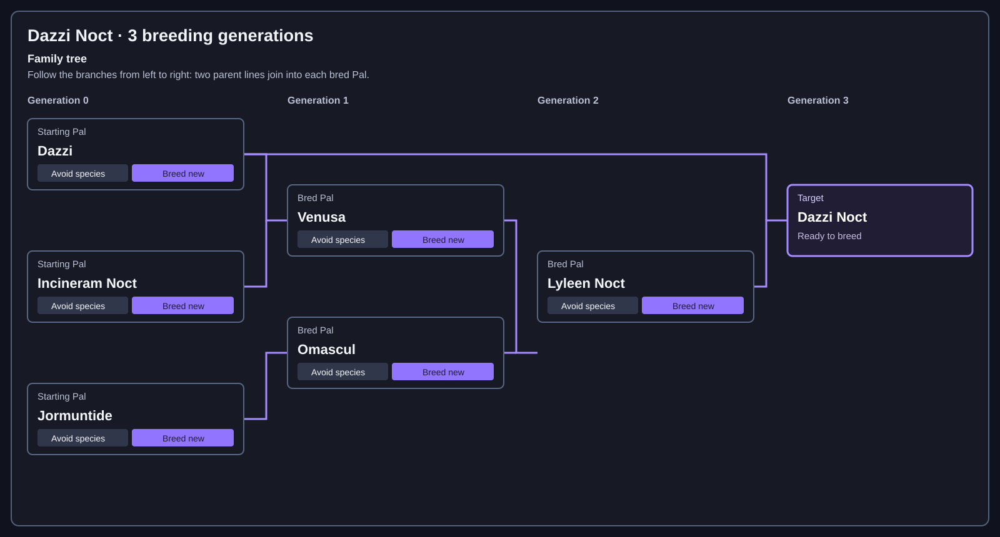

# Palpedia Snapshot

**Langue :** [English](README.md) · Français

Application Windows en lecture seule pour exporter un `Level.sav` Palworld et les sauvegardes de ses joueurs. Lancez normalement l’exécutable pour ouvrir l’interface graphique ; le mode ligne de commande reste disponible avec des arguments.

Chaque export crée un dossier horodaté distinct dans le dossier parent choisi, par exemple `export_08-09-2026 18-42`. Le séparateur des minutes est `-` car Windows interdit `:` dans les noms de dossiers.

Ajoutez ces fichiers de ce dossier à NotebookLM :

- `collection.md` — résumé de la collection du joueur et Pals actuellement dans l’équipe/le Palbox
- `pals.csv` — Pals actuellement possédés dans l’équipe ou le Palbox, avec leurs identifiants de traits passifs ; c’est la source de collection NotebookLM
- `capture-history.csv` — compte de captures du Paldeck par joueur
- `palpedia-progress.md` — résumé de collection actuelle et d’historique de capture utilisable dans NotebookLM
- `breeding-candidates.md` — Pals actuels regroupés par trait passif pour planifier l’élevage
- `breeding-rules.md` — règle exacte de l’espèce enfant, pour éviter que NotebookLM déduise un résultat par médiane
- `breeding-direct-pairs.csv` — espèce enfant exacte pour chaque paire d’espèces mâle/femelle actuellement possible
- `collection-diff.md` — changements depuis un export précédent, créé avec `--compare` (seulement lors d’une comparaison)

N’ajoutez **pas** `world.json` à NotebookLM. C’est un export technique complet pour le diagnostic, pas une source NotebookLM.

## Planificateur d’élevage et chemin le plus rapide

La version 3 ajoute des outils de planification intégrés et en lecture seule. L’application demande d’abord uniquement un `Level.sav` ; après l’avoir choisi, sélectionnez **Export NotebookLM**, **Planificateur d’élevage** ou **Chemin le plus rapide**. Seul l’espace choisi s’ouvre, les deux autres restant disponibles au-dessus. **Changer de sauvegarde** rouvre le sélecteur à tout moment.

Le planificateur peut :

- parcourir chaque Pal correspondant dans une liste de collection défilante ; rechercher par nom affiché, identifiant du jeu ou trait connu ; filtrer mâle/femelle ; et trier par niveau ;
- limiter la vue aux catalogues embarqués de traits passifs or (rang 3) ou diamant (rang 4), y compris Philanthropist, Babysitter et Demon God ;
- sélectionner un vrai Pal mâle et un vrai Pal femelle, garder leurs traits visibles, puis calculer l’espèce enfant exacte dans une carte de résultat encadrée ; et
- calculer un chemin textuel vers le nom ou le Character ID d’un Pal cible, avec le moins de générations d’élevage successives depuis la collection mâle/femelle chargée.

Le planificateur traduit les 299 identifiants de jeu embarqués vers leurs noms visibles dans le Palpédia : par exemple, `BOSS_GrassMammoth` est affiché comme **Mammorest**. Les identifiants bruts restent acceptés quand ils sont utiles.

Pour garder le sélecteur compact, les combinaisons identiques espèce/sexe/traits passifs sont représentées seulement par leur Pal de niveau le plus élevé. Les traits or utilisent des libellés jaunes et les traits diamant des libellés verts. Les identifiants passifs standards sont aussi traduits : par exemple, `CraftSpeed_up1` devient **Serious** et `PAL_ALLAttack_up1` devient **Brave**. Survolez un trait connu pour voir son effet en jeu. L’en-tête inclut un sélecteur de thème clair/sombre, et la configuration de sauvegarde/export choisie se replie dans de petits résumés pouvant être rouverts si nécessaire.

L’espace du chemin le plus rapide utilise des cartes encadrées dédiées à la cible et au résultat final. Il propose des suggestions de noms cliquables pendant la saisie. Son résultat est un arbre familial : chaque paire mâle/femelle mène à l’enfant qu’elle produit. Chaque nœud hors cible propose deux choix :

- **Éviter l’espèce** supprime entièrement cette espèce du chemin et cherche une alternative.
- **Élever à nouveau** retire seulement les exemplaires possédés de la collection de départ, puis ajoute la branche des parents de ce Pal au-dessus de l’arbre actuel. Le reste du chemin n’est pas remplacé. Utilisez-le de nouveau sur un grand-parent pour ajouter une génération antérieure si vous voulez aussi améliorer les traits de ce Pal.

Le chemin est un arbre familial connecté : les générations vont de gauche à droite et les deux lignes des parents se rejoignent vers le Pal qu’ils produisent. Les chemins à plusieurs étapes restent ainsi lisibles sans avoir à déchiffrer les relations écrites dans chaque carte.



Vous pouvez aussi limiter le chemin initial aux Pals avec des traits passifs or et/ou diamant, puis cliquer sur **Réutiliser tous les Pals** pour remettre à zéro chaque décision du chemin. Vous pouvez ainsi orienter un chemin d’espèces tout en décidant quels traits passifs individuels préserver. Si la cible est déjà dans la collection, l’application le précise puis calcule le chemin le plus court en excluant volontairement ces exemplaires. C’est utile lorsqu’il faut élever une nouvelle cible afin de lui transmettre un autre ensemble de traits passifs. Les parents mâle et femelle sélectionnés restent visibles dans des cartes dédiées au-dessus de la liste défilante des Pals.

Pour les chemins de plus de deux générations, l’application identifie aussi les Pals Philanthropist et Babysitter de la collection chargée et explique comment les utiliser pour accélérer la ferme d’élevage.

Le chemin est un plan d’espèces, pas une promesse d’œuf précis : l’héritage des passifs et le sexe de l’œuf restent soumis au hasard du jeu. L’interface le précise pour aider à planifier sans surestimer la certitude.

L’application ne modifie jamais les sauvegardes. Elle refuse de placer sa sortie dans le dossier de sauvegarde.

## Construire sous Windows

Clonez le dépôt avec le code du décodeur, puis lancez l’outil de construction avant le build Go :

```powershell
git clone --recurse-submodules https://github.com/Ltorre/palpedia-snapshot.git
cd palpedia-snapshot
# À lancer depuis Git Bash, WSL ou le runner Linux de GitHub Actions.
./scripts/build-ooz-windows.sh
go build -o palpedia-snapshot.exe .\cmd\palpedia-snapshot
```

Les releases GitHub officielles joignent l’exécutable Windows et `palpedia-snapshot-notebooklm-reference.zip`, le corpus NotebookLM de 31 fichiers. Vérifiez un binaire avec :

```powershell
.\palpedia-snapshot-windows-amd64.exe --version
```

Chaque release contient une note autonome, prête à servir de source, décrivant le format d’export, l’utilisation et les limites de sécurité.

## Interface graphique

Ouvrez l’exécutable Windows sans arguments. Il va :


- démarrer à l’emplacement de sauvegarde standard, `C:\Users\<WindowsUser>\AppData\Local\Pal\Saved\SaveGames` ;
- trouver les fichiers `Level.sav` à cet endroit, ou vous laisser en choisir un manuellement ;
- exporter par défaut vers un nouveau dossier horodaté dans `Documents\Palpedia Snapshot Exports`, en dehors des sauvegardes, ou vous laisser choisir le dossier parent avec le sélecteur de dossiers ;
- proposer **Ouvrir le dossier d’export dans l’Explorateur** après un export réussi, prêt à être glissé-déposé dans NotebookLM ;
- basculer entre français et anglais ; et
- conserver les contrôles de mondes partagés et de comparaison sous des options avancées clairement indiquées.

Pour un monde partagé, utilisez **Trouver les joueurs dans cette sauvegarde** dans les options avancées, puis sélectionnez un joueur. Laissez l’UID du joueur vide pour exporter tous les joueurs.

Le dossier parent d’export peut être sur un autre disque, par exemple `I:\Palworld export` ; un volume Windows différent est toujours hors du dossier de sauvegarde. Gardez les anciens dossiers `export_<date heure>` à cet endroit et choisissez-en un avec **Choisir l’export précédent** lors de la création d’une comparaison.

## Créer votre propre notebook NotebookLM

Palpedia Snapshot embarque tout le [corpus de référence Palworld](notebooklm/palworld-reference) : 31 sources Markdown compactes couvrant 299 Pals, les compétences, objets, équipements, structures, technologies, carte, outils, tier lists et le contexte d’élevage. Il n’y a aucun notebook public partagé à dupliquer.

1. Ouvrez [NotebookLM](https://notebook.google.com/) et connectez-vous avec votre propre compte Google.
2. Créez un notebook, puis ajoutez les 31 fichiers Markdown dans `notebooklm/palworld-reference`.
3. Créez un nouvel export Palpedia Snapshot et ajoutez chaque fichier personnel de son dossier `export_<date heure>`, sauf `world.json`.
4. Posez des questions qui nomment à la fois les fichiers personnels et les sources de référence utiles. Pour l’élevage, incluez `breeding-rules.md`, `breeding-direct-pairs.csv` et `breeding-candidates.md` afin que NotebookLM utilise le résultat exact plutôt que d’inférer une médiane.

Le corpus et les huit fichiers personnels facultatifs totalisent 39 sources, ce qui laisse de la place dans un notebook limité à 50 sources. Lorsqu’un nouvel export est créé, remplacez les anciens fichiers personnels dans NotebookLM par les plus récents. Consultez le [guide de configuration NotebookLM](notebooklm/README.md) pour la liste des fichiers, les instructions de mise à jour et des prompts.

`passive_traits` contient les identifiants exacts des compétences passives du jeu. Cela maintient la fiabilité de l’export lors des mises à jour ; le corpus embarqué fournit le contexte de référence tandis que les identifiants bruts restent disponibles pour un filtrage précis.

## Exporter

Dans une installation Steam classique, les mondes locaux se trouvent sous :

```text
C:\Users\<WindowsUser>\AppData\Local\Pal\Saved\SaveGames\<SteamID>\<WorldID>\Level.sav
```

`<WorldID>` est le dossier du monde contenant à la fois `Level.sav` et le dossier `Players` correspondant. L’interface graphique cherche automatiquement à cet endroit ; en ligne de commande, indiquez le `Level.sav` exact à inspecter.

```powershell
.\palpedia-snapshot.exe `
  --level "D:\path\to\Level.sav" `
  --output "D:\path\to\export"
```

`Level.sav` doit avoir son dossier `Players` correspondant à côté de lui, sauf si vous passez explicitement `--players-dir`. `--output` est obligatoire, doit se trouver hors du dossier de sauvegarde et correspond au dossier parent d’un nouveau snapshot `export_<date heure>`. Les snapshots existants ne sont jamais remplacés.

### Mondes partagés : exporter la collection d’un joueur

Listez les identifiants de joueurs de la sauvegarde, puis utilisez l’UID choisi avec `--player` :

```powershell
.\palpedia-snapshot.exe --level "D:\path\to\Level.sav" --list-players

.\palpedia-snapshot.exe `
  --level "D:\path\to\Level.sav" `
  --output "D:\path\to\personal-export" `
  --player "player-uid-from-list"
```

Avec `--player`, `pals.csv`, `capture-history.csv` et `collection.md` ne contiennent que les données de ce joueur. `world.json` reste l’export complet du monde.

### Comparer deux snapshots de collection

Faites pointer `--compare` vers un dossier d’export plus ancien. Le nouvel export inclura `collection-diff.md`, avec les ajouts et suppressions d’équipe/Palbox ainsi que les gains de capture du Paldeck.

```powershell
.\palpedia-snapshot.exe `
  --level "D:\path\to\Level.sav" `
  --output "D:\path\to\new-export" `
  --compare "D:\path\to\previous-export" `
  --player "player-uid-from-list"
```

Les sauvegardes modernes `PlM` utilisent la compression Oodle. L’exécutable Windows inclut le décodeur open source Ooz ; aucun DLL du jeu, aucune installation Steam ni chemin supplémentaire ne sont nécessaires. Lors de la première utilisation, il place un petit décodeur vérifié par hash dans le cache utilisateur Windows, l’exécute seulement sur une copie temporaire des données compressées, puis supprime ces données temporaires. Il ne copie, ne modifie ni n’écrit jamais dans les sauvegardes du jeu.

## Sécurité et périmètre

- Lit uniquement `Level.sav`, `LevelMeta.sav` optionnel et les fichiers `.sav` des joueurs.
- N’effectue aucune requête réseau à l’exécution.
- Embarque le décodeur Ooz sous GPLv3 ; le code du programme et les binaires de release sont distribués sous GPLv3. Les exports générés et vos données de sauvegarde ne sont pas couverts par cette licence.
- Exporte les `CharacterID` internes exactement tels qu’ils sont stockés ; il ne devine pas de noms de Pals localisés.

Le parseur est basé sur le parseur de sauvegardes Palhelm sous Apache-2.0, et le décodeur embarqué est construit à partir des sources Ooz GPLv3. Consultez [NOTICE](NOTICE).
