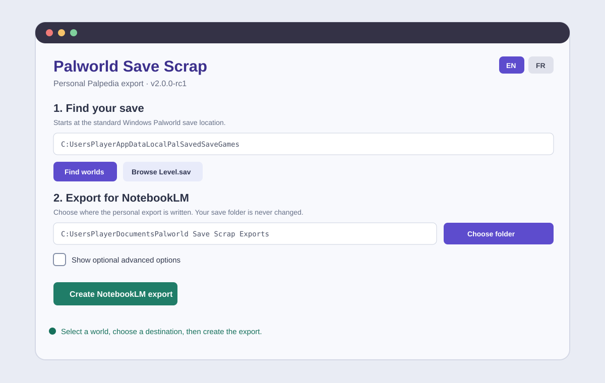

# v2.0.0-rc1 — Windows graphical interface preview

`v2.0.0-rc1` is a test build only. It is prepared on the `v2.0.0-rc1` branch for local validation before any merge, version tag, GitHub release, or change to the stable binaries.



## What changed

- Opening the Windows executable with no arguments launches a desktop interface.
- The interface starts with the standard Palworld save location:
  `C:\Users\<WindowsUser>\AppData\Local\Pal\Saved\SaveGames`.
- It searches for worlds automatically and also offers a file picker for `Level.sav`.
- The export destination has a native folder picker, so typing a Windows path is optional.
- Every export is placed in a separate folder such as `export_08-09-2026 18-42`; Windows does not allow `:` in folder names.
- After exporting, **Open export folder in Explorer** makes the generated NotebookLM files ready to drag and drop.
- Add `collection.md`, `pals.csv`, `capture-history.csv`, `palpedia-progress.md`, `breeding-candidates.md`, and—when comparing—`collection-diff.md` to NotebookLM. Do not add `world.json`.
- An export folder on another Windows drive is accepted, for example a save on `C:` and an export on `I:`.
- English and French are available from the header.
- Advanced controls are explicitly optional and explain when they are needed:
  `Players` directory, a player for shared worlds, a previous export for comparison, and overwrite mode.
- A player picker reads the selected shared world and fills the Player UID without requiring a terminal command. Leave it empty to export every player.
- Modern compressed saves are decoded by the included open-source Ooz component. No Steam installation, game DLL, or manual path is required.

## Test checklist

1. Copy the RC executable somewhere convenient and open it by double-clicking.
2. Confirm it finds a world at the default location, or use **Browse for Level.sav**.
3. Choose an export parent directory outside the save folder.
4. Create an export and confirm a new `export_<date time>` folder contains the listed NotebookLM files.
5. Click **Open export folder in Explorer** and confirm it opens the new snapshot.
6. Switch language and confirm the interface text changes.
7. If this is a shared world, open advanced options, choose **Find players in this save**, choose your player, then export again.

Modern compressed saves use the included GPLv3 Ooz decoder. On first use, the application writes a hash-checked decoder helper to the user's cache and uses temporary files for decompression. It never copies, downloads, changes, or writes into game save files.

The project and its release binary are GPLv3 because they include this decoder. The complete corresponding source, including the decoder submodule and its build script, is in this branch. Your save files and generated exports remain your data; they are not relicensed.

## Stable CLI

The existing command-line usage is still supported whenever arguments are supplied. For example:

```powershell
.\palpedia-snapshot.exe --level "D:\path\to\Level.sav" --output "D:\path\to\export"
```

No public GitHub release is created from this release candidate.
